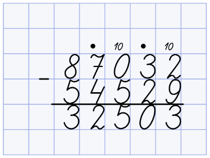
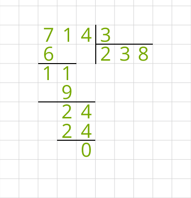
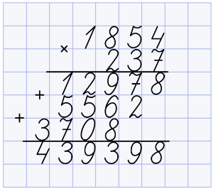

# **Домашнее задание №5**

## Calculator

Необходимо создать web-приложение, где пользователь мог бы ввести два числа и выбрать арифметическую операцию. После нажатия на кнопку “равно”,
пользователю должен вывестись расчёт арифметической операции столбиком.

## Требования

1) Считаем, что пользователь может ввести только натуральные положительные целые числа
2) Приложение должно быть разработано без JS, с использованием Razor Pages.
3) В качестве арифметических операций доступны только “+” (сложение) и “-” (вычитание). При вычитании из меньшего большего, в столбике числа менются
   местами, но в результате выводится знак минус.

## Требование со звездочкой \*

1) Добавить в арифметические операции “\*” (умножение)

## Требование с двумя звездочками \*\*

1) Добавить в арифметические операции “/” (деление)

## Примерные макеты

Ниже представлены примерные макеты приложения. Не обязательно реализовывать точь-в-точь, но важно, чтобы интерфейс пользователя не ухудшался.
Например, при отображении расчёта арифметических операций не обязательно отрисовывать тетрадную клетку, но важно, чтобы числа не разъезжались, и было
визуально понятно какое число под каким находится.

Форма:

Селект выбора арифметической операции:

Примеры изображения расчёта арифметических операций столбиком:

